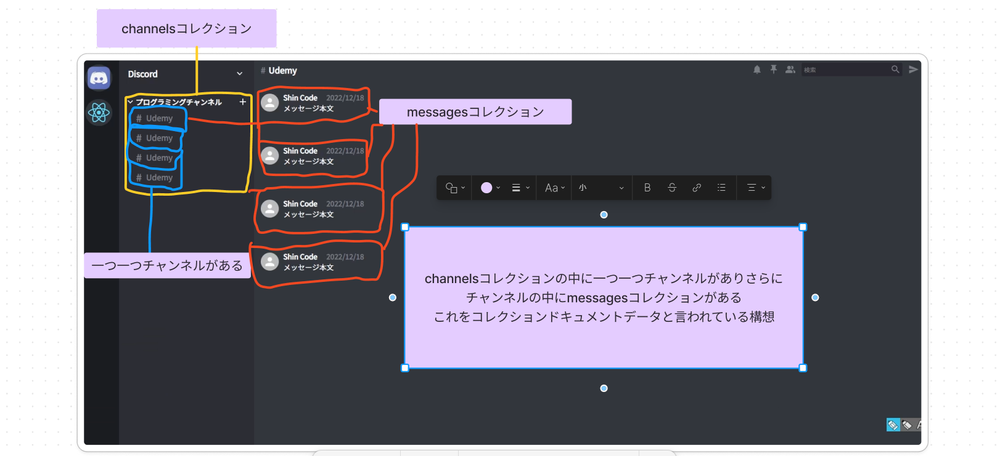
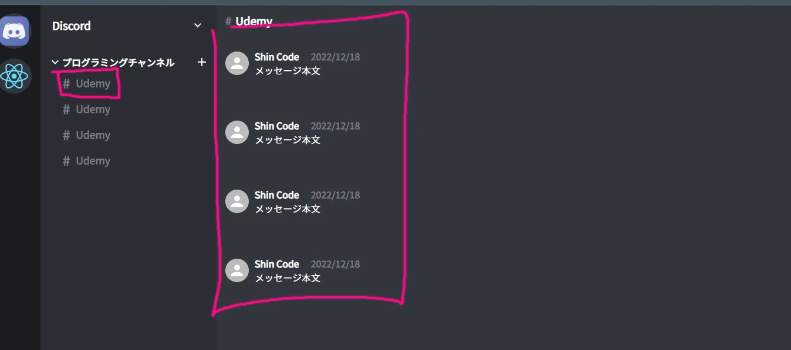

## チャンネルやメッセージをfirebase.Reduxを使って管理する
- cloudFirestore内にコレクションを準備(データの挿入)
    コレクションドキュメントデータと言われている構想
    

    - 1.コレクションの開始ボタンからIDをchannelsとする
    - 2.ドキュメントID＝自動IDで作成,
        フィールド＝空　タイプ=string　値=空
    このchannelsは下図のchannelNameフィールドとmessagesコレクションを持つ
    
    - 3.フィールドを追加する
        フィールド=channelName タイプstring 値=React
    - 4.channelコレクション内にmessagesコレクションを作成
        ドキュメントID＝自動IDで作成,
        フィールド＝空　タイプ=string　値=空
    - 全体のchannelsがあってその中に一つ一つchannelがありそのchannelの中にchannelNameとmessagesコレクションを持っている

    - 新しいドキュメントチャンネルを追加
    2,3,4を実施その中で値ReactをTypescript(基本なんでもいいはず)と変更して追加

- cloudFIreStoreに挿入したデータを取り出す
https://firebase.google.com/docs/firestore/query-data/listen?hl=ja
    今回はリアルタイムにデータベースを取得する
    ドキュメントを取り出すには(onSnapshot関数)
    コレクションを取得するにはURL内のコレクション内の複数のドキュメントを取得
- 1.sidebar.tsxにてuseEffect(onsnapshot)を記述
    発火するタイミングは一回で大丈夫(空の引数を準備)
    変数は今回は必要なし
    onsnapshotをインポート,第一引数にq(query),変数でquerySnapshot
    変数の空の配列を準備const channelsResults = [];
    querySnapshot.docsの中のforEachで一つ一つ展開していく
    一つ一つをdocという形にしてconsoleで表示

    ```
        useEffect(() => {
        onSnapshot(q,(querySnapshot) =>{
            const channelsResults = [];
            querySnapshot.docs.forEach((doc) => console.log(doc))
        })
    },[])
    ```

    - 同時にコレクションを定義
    firebaseファイルからimport
    ```
    const q =query(collection(db,"channels"));
    ```
## error対応 react-error-boundaryライブラリでerrorの詳細を確認
https://www.npmjs.com/package/react-error-boundary
- <ErrorBoundary>コンポーネントで、エラーを吐き出す可能性のあるコンポーネントをラップすることによりそのコンポーネントとその子孫によってスローされたエラーも処理される

- npm i react-error-boundaryでvscodeにインストール
- 1.srcフォルダ内にutilsファイルを作成
- 2.ErrorFallBack.tsxを作成
- 3.動画内の記述を引用
- 4.export constでどこのファイルでも使えるようにする
- 5.App.tsxでエラーが出ているコンポーネントを<ErrorBoundary>でラッピングする
- 6.FallbackComponent={ErrorFallBack}と記述　ErrorFallBackはutillファイルから呼び出し


## firebaseからデータを取得しチャンネルリストに表示させる
- 前回のuseEffect内のconsole.log(doc)を削除しchannelsResultsの中にpushする配列を入れていくことができる
    今回はchannelIDとchannelを入れる
    doc.idはfirebaseのドキュメントのIDを取得
    doc.data()はドキュメントID内のフィールドを取得


    ```
        useEffect(() => {
        onSnapshot(q, (querySnapshot) =>{
            const channelsResults = [];
            querySnapshot.docs.forEach((doc) => channelsResults.push({
                id: doc.id,
                channel: doc.data(),
            }))
        })

    },[])
    ```


    - 1.取得してきたデータはuseStateで管理する必要がある為、usestateを準備する

    ```
    const [channels, setChannels] = useState([]);
    ```
    - 2.今回はTypescriptで記述している為、querySnapshot内のidとchannelの型を指定する
    ```
    interface Channal {
    id:string;
    channel:DocumentData;
    }
    ```
    - 3.useStateにジェネリクスの形で配列で渡しておく 
    usestate内にinterface内の型を指定することでこの型を持った配列しか入らない制限をかける

    ```
    const [channels, setChannels] = useState<Channal[]>([]);
    ```

    - 4.setChannelsをuseEffect内に記述、またその中にchannelsResultsを渡す
    channelsResultsで型指定がないとエラーが出た為、Channal[]を指定するとエラーが消える
    ```
        useEffect(() => {
        onSnapshot(q, (querySnapshot) =>{
            const channelsResults:Channal[] = [];
            querySnapshot.docs.forEach((doc) => channelsResults.push({
                id: doc.id,
                channel: doc.data(),
            })
            );
            setChannels(channelsResults)
        });
    },[])
    ```

    
    - useStateのsetChannelsで状態変数を管理し、onSnapshotが走るとchannelsにデータ群を取得しchannelsをmap関数で展開するとチャンネルリストが表示できるようになる

## App.tsx(親)からsidebarChannel(子)にchannel(props)を渡していく
- App.tsx内のsidebarChannelコンポーネントにpropsを渡すためのコードを記述
    ```
    <SidebarChannel channel={channel} id={channel.id}/>
    ```

    - sidebar.tsxでchannel(props)を受け取る為の準備
    型の定義を行う
    ```
    type Props ={
      id:string;
      channel: DocumentData;
    };
    ```
    - SidebarChannelにpropsを渡すための記述
    props(変数)の型を事前に準備したPropsの型定義をする
    ```
    const SidebarChannel = (props:Props) 
    ```

    - 上記のpropsからidとchannelを取り出す
    分割代入という形でまとめて取り出す
    下記の記述はどちらも同じ意味
    ```
    分割代入　　　　　　　　　　　　　　分割代入じゃない
    const { id,channel} = props;　＝ const { id,channel} = props.id,props.channel
    ```
    - channelNameを取り出す
    これまで取り出してきたchannelデータの中のchannelの中のchannelNameを取り出す記述
    取り出したいデータはconsole.logで確認するとスムーズにいける
    ```
    {channel.channel.channelName}
    ```
    - Warning: Each child in a list should have a unique "key" prop.
    keyの設定が出来ていないとのエラーが出た為、sidebar.tsxでkeyの設定を行う

    - sidebar.tsxでkeyの設定
    ```
     <SidebarChannel 
        channel={channel} 
        id={channel.id} 
        key={channel.id}/>
    ```

## リファクタリング コレクションを取り出すカスタムフックスを作成する
    useEffectでonSnapshotを作動しているが、queryに他のコレクションがあった場合、
    channelsじゃなく違う名前のコレクションがあった場合、
    customhooksというのを自作し呼び出す事が出来る
    ```
       const q = query(collection(db,"channels"));

        useEffect(() => {
        onSnapshot(q, (querySnapshot) =>{
            const channelsResults:Channal[] = [];
            querySnapshot.docs.forEach((doc) => channelsResults.push({
                id: doc.id,
                channel: doc.data(),
            })
            );
            setChannels(channelsResults)
        });
    },[])
    ```
    カスタムフックスで作ると再利用が出来るため、複雑な記述はカスタムフックスにしておいた方がいい
    - 1.srcディレクトリ内にhooksフォルダを作成しuseCollection.tsxを作成
    - 2.useCollection.tsx内にsidebar.tsx内の下記コードを切り取り
    　　再利用したい処理を記述したコードを記述

    ```
        const [channels, setChannels] = useState<Channal[]>([]);
    
    const q = query(collection(db,"channels"));

    // 発火タイミングは一回のみの為空の引数
    useEffect(() => {
        onSnapshot(q, (querySnapshot) =>{
            const channelsResults:Channal[] = [];
            querySnapshot.docs.forEach((doc) => channelsResults.push({
                id: doc.id,
                channel: doc.data(),
            })
            );
            setChannels(channelsResults)
        });
    },[])
    ```
    3.sidebar.tsx内で下記の記述を行い、()内にコレクション名を入れて取り出すという処理を想定
    今回はchannelsしかないが、複数あって分割代入で取り出す際は
    例exampleCollectionだと引数にexampleを記述するだけでコレクションのドキュメントを取り出す事が出来る
    ```
    const {} = useCollection("channels")
    ```
    4.useCollection.tsx内で引数を受け取れるようにデータを入れる（data:stringの形）
    ```
    const useCollection = (data:string) 
    ```
    5.useStateの引数を下記の記述に変更する(channel setchaをdocに変更)
    ```
    const [documents, setDocuments] = useState<Channals[]>([]);
    ```
    6.クエリの名前を変更し(q⇒collectionRef)型を指定する
    ```
    const collectionRef = query(collection(db,"channels"));
    ```
    7.useCollection,tsx内の記述を下記に変更
    おさらい
    名称を変更,queryに型を指定,
    documentsに最終的に入っているリアルタイムのデータをreturnで返す
    useCollection関数のreturnの為、sidebar.tsxで呼び出すと
    constの分割代入で取り出せるようになる

    ```
    const useCollection = (data:string) => {
    const [documents, setDocuments] = useState<Channals[]>([]);


    const collectionRef:Query<DocumentData> = query(
        collection(db,data));

    // 発火タイミングは一回のみの為空の引数
    useEffect(() => {
        onSnapshot(collectionRef, (querySnapshot) =>{
            const channelsResults:Channals[] = [];
            querySnapshot.docs.forEach((doc) => channelsResults.push({
                id: doc.id,
                channel: doc.data(),
            })
            );
            setDocuments(channelsResults)
        });
    },[])


      return {documents};
    }
    ```
    このカスタムフックスはfirebase内のコレクション（channels）のドキュメント（固有のID）を取り出すための関数

    8.分割代入の取り出し方
    下記の記述
    ```
     const { documents:channels} = useCollection("channels")
    ```
