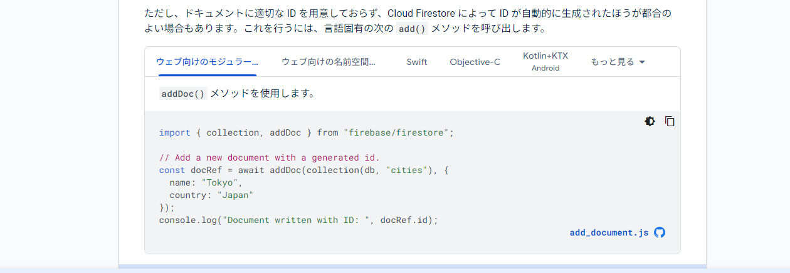
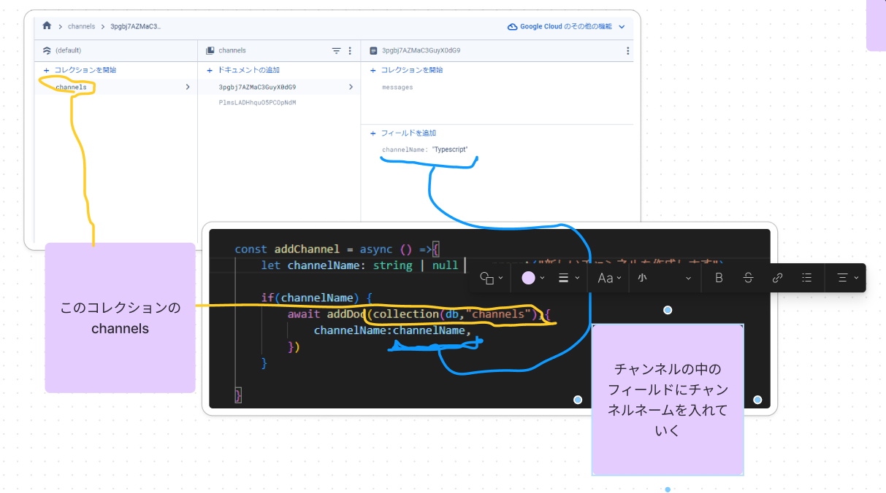
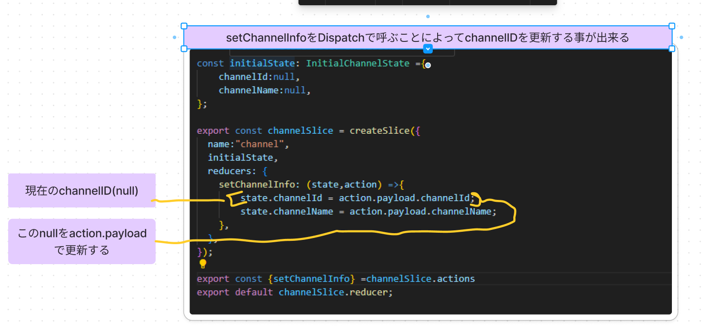
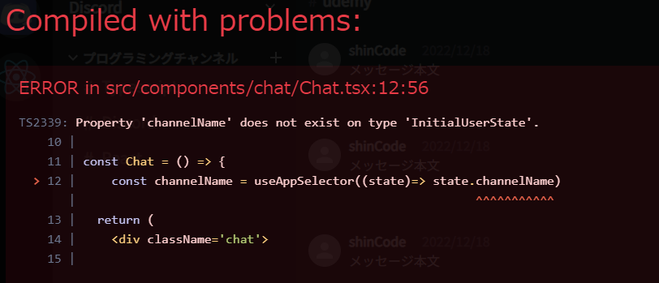

## channelを＋ボタンで追加する機能を実装
- sidebar.tsx内のAddIconにonClickを追加
    ```
     <AddIcon className='sidebarAddIcon' onClick={() => addChannel()} />
    ```
    - addChannelでprompt関数を使用し作成するチャンネル名入力をさせる記述
    channelNameという変数に打ち込んだチャンネル名を与える
    firestoreにドキュメント追加するにはaddDoc関数を使用する
    

    - addChannel内の記述
    非同期処理の為awaitの後にaddDocとし、asyncを追加
    addDocの第一引数は(collection(db,"channels"))
    第二引数はchannelName:channelName,

    ```
        const addChannel = async () =>{
        let channelName: string | null  =  prompt("新しいチャンネルを作成します")

        if(channelName) {
            await addDoc(collection(db,"channels"),{
                channelName:channelName,
            })
        }

    }
    ```

    

## チャンネル情報をReduxで管理
    チャンネルの名前をクリックしたらヘッダーにチャンネル名を表記する
    どのチャンネルをクリックしたのかはReduxで管理していく
- 1.channelSlice.tsをfeaturesフォルダの中に作成
    useSlice.tsとほぼ同じ処理を行うため、コピーし初期化する
    ```
    import { createSlice} from "@reduxjs/toolkit"
    import { InitialUserState } from "../Types";
    const initialState: InitialUserState ={
        user:null,
    };
        export const userSlice = createSlice({
          name:"channel",
          initialState,
          reducers:{},
    });
    export const {} =userSlice.actions
    export default userSlice.reducer;
    ```
- 2.Types.tsで型を定義する
    ```
    export interface InitialChannelState {
    channelId: string | null;
    channelName:string | null;
    }
    ```
- 3.channelSlice.tsで型定義したinitialChannelStateを呼び出しinitialstateを変更する
    選択するという意味でreducersの中身はsetChannelInfoとしstateとactionを受け取る
    

- 4.SidebarChannel.tsxでdispatchをする
    チャンネルをクリックした際にReducerを発火させる
    dispatch変数を用意してuseAppDispatchを呼ぶ
    divタグのsidebarChannelにonclickを追加しdispatchさせる
    setChannelInfoをdispatchの中で呼ぶ
    ```
    const dispatch =useAppDispatch()

        <div className='sidebarChannel' onClick={()=>
      dispatch(
        setChannelInfo({
          channelId:id,
          channelName: channel.channel.channelName
          })
      )
    }>
    ```
- 5.4で更新したIDとNameをuseAppSelectorでChat.tsx内で取り出す
    useAppSelector((state)=> state.channelName)で現在の状態を取得
    ```
    const channelName = useAppSelector((state)=> state.channelName)
    ```

## エラー


対応方法
store.ts内にてreducerの設定がuserReducerしか設定していなかった
reducerに名前を付けて、channelSlice.tsにも設定していく必要がある
- 1.store.ts内にてreducerの設定を行う
    ```
    export const store = configureStore ({
    reducer:{
        user:userReducer,
        channel:channelReducer,
    } ,
    });
    ```
- 2.Chat.tsx内のuseAppSelectorを修正
    ```
    const channelName = useAppSelector((state)=> state.channel.channelName)
    ```
- 3.Sidebar.tsx,App.tsx内のuseAppSelectorを修正
    ```
    const user = useAppSelector((state) => state.user.user);
    ```
対応終了

## チャンネルの情報を渡す
- 1.Chat.tsx内のChatHeaderコンポーネントにchannelNameを受け取れるように記述
    ```
    <ChatHeader channelName={channelName}/> 
    ```
- 2.channelHeader.tsx内で受け取る時の型指定を行う
    ```
    type Props = {
    channelName:string|null;
    };
    ```
- 3.propsの受け取り方
    分割代入で受け取り、h3タグ内で表示する
    ```
    const ChatHeader = (props:Props) => {
    const {channelName} = props;

    return(
               <div className="chatHeaderLeft">
            <h3>
                <span className='chatHeaderHash'>#</span>
                {channelName}
            </h3>
        </div>
    )

    }
    ```