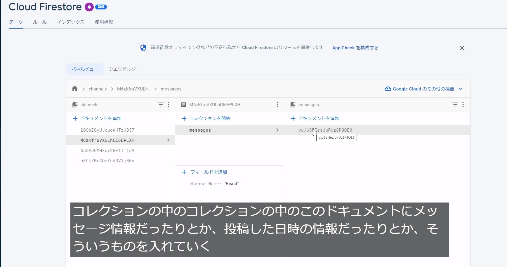
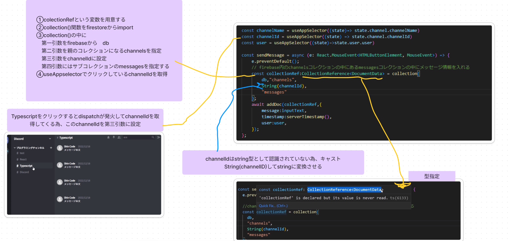
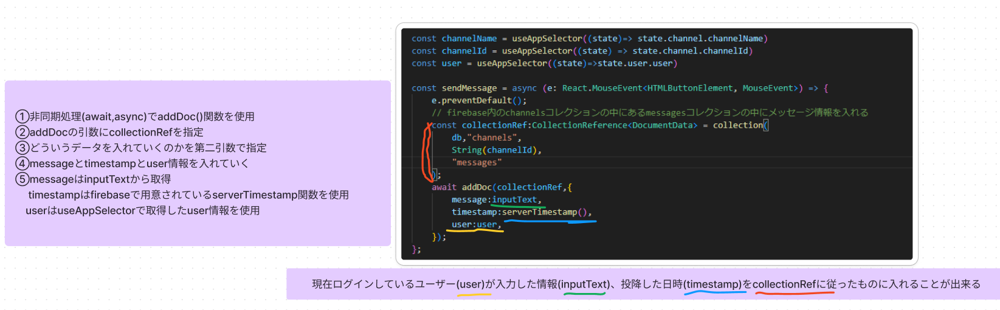
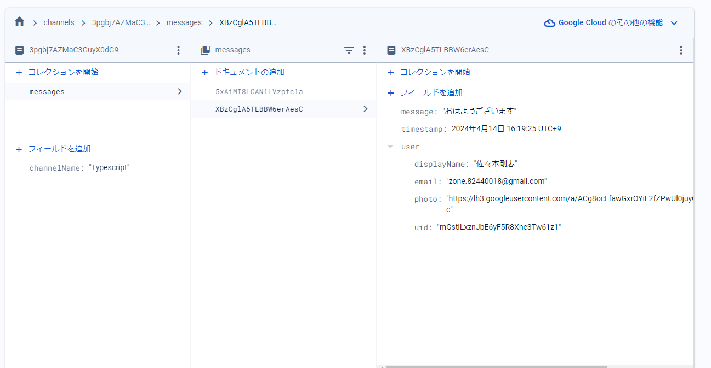
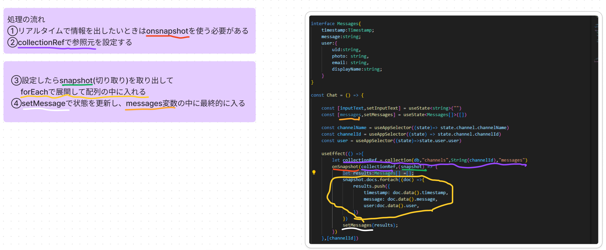

## （前回チャンネル情報をReduxで管理）チャット送信する為の入力文字列を取得する
- 1.入力した文字列をチャットに反映させる
    まず打ち込んだ文字列を取得する
    chat.tsx内で文字列を取得する為の状態変数を用意する
    ```
    const [inputText,setInputText] = useState<string>("")
    ```
- 2.inputタグにonChangeを追加
    ```
    onChange={(e) => setInputText(e.target.value)}/>
    ```
- 3.eに型をつける
    ここまででconsole.log(inputText)を見るとinput内で入力した文字を取得してることが見える
    ```
    onChange={(e:React.ChangeEvent<HTMLInputElement>) => setInputText(e.target.value)}
    ```
## 取得した文字列をEnterキーを押したら送信しfirebaseのメッセージコレクションに入れる
    firebaseのReactに入れたい場合は、Reactのmessageコレクションの中に入れていく
    入れる情報として、
    1.文字の情報　
    2.いつ投稿されたかのtimestamp　
    3.誰が投稿したかのユーザー情報
- 1.inputのEnterキーを押したら発火させるためchat.tsx内のbuttonタグにonclickを追加する
    ```
    onClick={(e: React.MouseEvent<HTMLButtonElement, MouseEvent>)=>sendMessage(e)}
    ```
- 2.sendMessageの関数を準備する
    送った時にページをリロードしてほしくない為、preventDefault()を呼び出す
    ```
        const sendMessage =(e: React.MouseEvent<HTMLButtonElement, MouseEvent>) => {
        e.preventDefault();
        console.log("sendMessage");
    };
    ```
- 3.打ち込んだ文字列をfirebaseに入れていく処理
    firebase内のchannelsコレクションの中にあるmessagesコレクションの中にメッセージ情報を入れる
    
    処理方法はsidebar.tsx内のaddChannelと似ている
    追加記述内容
    ```
        const channelId = useAppSelector((state) => state.channel.channelId)
        const user = useAppSelector((state)=>state.user.user)
            const collectionRef:CollectionReference<DocumentData> = collection(
            db,"channels",
            String(channelId),
            "messages"
            );
        await addDoc(collectionRef,{
            message:inputText,
            timestamp:serverTimestamp(),
            user:user,
        });
    ```
    
    
    これでfirebase内の指定したチャンネルコレクションのmessageの中に文字列を入れれる
    

## onSnapshotでリアルタイムにメッセージ情報を取得する

- 1.chat.tsx内にuseEffectを記述
    チャンネル名をクリックするたびに、useEffectを発火するために
    第二引数をchannelIdとする
    そうすることでonsnapshotが毎回発火しチャット内容も変わる
    第一引数にコレクションの参照元を入れる必要がある
    ```
        useEffect(() =>{
        let collectionRef = collection(db,"channels")
        onSnapshot()
    },[channelId])
    ```
- 2.collectionの参照元を指定
    サブコレクションのmessageから取り出すため、collectionの第一引数をdb
    第二引数を"channels"
    第三引数にどのチャンネルから取ってくるか指定するためにchannelId
    第四引数に"messages"
    ```
    let collectionRef = collection(db,"channels",String(channelId),"messages")
    ```
- 3.onSnapshot記述
    collectionRefを第一引数に含め参照してきたものをonSnapshotという変数で取り出す
    ```
    onSnapshot(collectionRef,(snapshot)=>{})
    ```
    展開する必要がある為配列を用意する
    ```
    let results:Messages[] =[];
    ```
    複雑なため画像にて説明
    

## ディスコードチャット欄にメッセージを表示
    firebaseから取得したデータをmap関数で展開していく
    useStateのmessagesの中に状態変数が入っているため
    これを展開していく
- 1.chat.tsx内のchatMessageタグの中にmap関数を展開
    ```
                {messages.map((message) =>
                <ChatMessage/>
            )}
    ```
- 2.ChatMessageコンポーネントに引数を渡す
    キーを設定(今回はindexだが削除機能とかを追加する場合等、基本的には固有のID等を設定するほうがよい)
    indexは第二引数で指定すると取る事が出来る

    ```
                {messages.map((message,index) =>
                <ChatMessage key={index}/>
            )}
    ```

- 3.チャットに表示するメッセージとタイムスタンプとユーザー情報を取り出す記述
    ```
                {messages.map((message,index) =>
                <ChatMessage key={index}
                message={message.message}
                timestamp={message.timestamp}
                user={message.user}
                />
            )}
    ```
- 4.messageに赤い波線が出るため、Typescriptのエラー
    受け取るChatMessage側のコンポーネントで宣言していない為のエラー
    ChatMessage.tsx内にて
    ```
    受け取るPropsの型を指定
    type Props = {
      timestamp:Timestamp;
      message:string;
      user:{
      uid:string,
      photo: string,
      email: string,
      displayName:string;
        };
    }
    
    const ChatMessage = (props:Props) => {
      const {message,timestamp,user} = props
      return (
          )
    }
    ```
- 5.ChatMessage.tsx内で表示させる
    pタグをmessage
    h4タグをuser.displayName
    timestampはReactnodeにtimestampを当てはめれないとエラーを出すため、文字列に変換しないといけない
    日付のインスタンスでnew Date()の中に入れると日付として認識される
    toLocalestring()関数を呼び出す
    toDate()関数を呼び
    日付に変換した状態で文字列として認識できるようになる

    まとめ
    toDate()で日時に変換してそれをnew Dateでインスタンス化したものを文字列にする処理
    ```
    {new Date(timestamp.toDate()).toLocaleString()}
    ```
- 6.?を追加
    ユーザーが存在したときだけプロパティを参照する
    なかった場合は参照しない
    ```
    {user?.displayName}
     <span className='messageTimestamp'>{new Date(timestamp?.toDate()).toLocaleString()}</span>
    ```
- 7.アイコンの変更
    ```
    <Avatar src={user?.photo}/>
    ```
## メッセージを投稿した順番にソートして表示させる
    またメッセージを送信したあとにinputに残っている文字列を削除する機能実装

- 1.Chat,tsx内にてリアルタイムで取得してくる時にソートすればいい為、
    collectionRefにorder()関数を準備する
    collectionRefOrderByという変数名を用意しqueryをimportする
    queryの第一引数に参照したいcollectionRefを挿入
    第二引数にorderBy()関数を入れる
    ```
    const collectionRefOrderBy = query(collectionRef,orderBy(""))
    ```
- 2.timestampに基づいて新しい順にソートする為にorderBy()にtimestampを入れdescを指定する
    descとaskは昇順降順の違い
    ```
    const collectionRefOrderBy = query(collectionRef,orderBy("timestamp", "desc"))
    ```
- 3.onSnapshotにcollectionRefOrderByを追加する
    ```
    onSnapshot(collectionRefOrderBy,(snapshot) )
    ```
- 4.送信したメッセージを削除する
    Enterキーを押したらsetInputTextを空にする
    sendMessageの最後にsetInputText("")を記述
    ```
        const sendMessage = async (e: React.MouseEvent<HTMLButtonElement, MouseEvent>) => {
        e.preventDefault();
        // firebase内のchannelsコレクションの中にあるmessagesコレクションの中にメッセージ情報を入れる
        const collectionRef:CollectionReference<DocumentData> = collection(
            db,"channels",
            String(channelId),
            "messages"
        );
        const docRef:DocumentReference<DocumentData> = await addDoc(collectionRef,{
            message:inputText,
            timestamp:serverTimestamp(),
            user:user,
        });
        console.log(docRef);
        setInputText("");
    };
    ```
    input属性の中にvalue属性を入れる
    inputに文字情報を格納するvalueにinputTextを反映させる
    ```
    <input 
        type="text" 
        placeholder='#Udemyへメッセージを送信' 
        onChange={(e:React.ChangeEvent<HTMLInputElement>) => setInputText(e.target.value)}
        value={inputText}
    />
    ```

## 投稿しすぎるとレイアウトがずれるバグの修正
    ```
    .chat {
    display: flex;
    flex-direction: column;
    flex-grow: 1;   
    background-color: #35393e;
    height: 100vh;

    .chatMessage {
        height: 100vh;
        overflow-y: scroll;
    }
    }
    ```

## サブコレクションデータ取得をカスタムフックスで切り出す
    サブコレクションを取り出す際にchat.tsx内にuseEffectを直書きし、
    sidebar.tsx内のuseCollectionで親のコレクションの名前を指定して
    hooksから取り出すという作業
    ```
    const { documents:channels} = useCollection("channels")
    ```
    をしたので、せっかくなのでusesubcollectionも作成する

- 1.hooksフォルダの中にuseSubCollection,tsxを作成
- 2.useCollection.tsxと記述が似ている為コピーしてくる
- 3.useCollectionをuseSubCollectionに名前を変更する
- 4.chat.tsx内のuseEffectの中身を切り取りしてくる
- 5.channelIdのuseAppselectorも切り取ってくる
    ```
    const channelId = useAppSelector((state) => state.channel.channelId)
    ```
- 6.Messagesも切り取ってくる
    ```
    interface Messages{
    timestamp:Timestamp;
    message:string;
    user:{
        uid:string,
        photo: string,
        email: string,
        displayName:string;
        }
    }
    ```
- 7.interfaceのChannelsとcollectionRef:Query・・・は削除
- 8.orderByとinterface内のTimestampをimport
- 9.usestateの名前を変更
    ```
    const [subDocuments, setSubDocuments] = useState<Messages[]>([]);
    ```
- 10.returnをsubDocuments, setSubDocuments(results)に変更
- 11.useSubCollectionの引数を今回2つ取るので親コレクションとサブコレクション
    ```
    const useSubCollection = (collectionName:string,subCollectionName:string) 
    ```
- 12.collectionに親コレクションのcollectionNameとsubcollectionを追加
    ```
    collection(db,collectionName,String(channelId),subCollectionName)
    ```
- 13.chat.tsxでカスタムフックスを呼び出す
    今回は２つ引数を取り出す為、少し特殊となるが
    subDocumentsからmessagesを取り出し、
    useSubCollectionをimportし2つの引数を指定
    親のコレクション名とサブコレクション名
    ```
    const {subDocuments:messages}= useSubCollection("channels","messages")
    ```
- 14.messagesを取り出す事が出来、下記のmap関数で展開できる
    ```
                {messages.map((message,index) =>
                <ChatMessage key={index}
                message={message.message}
                timestamp={message.timestamp}
                user={message.user}
                />
            )}
    ```