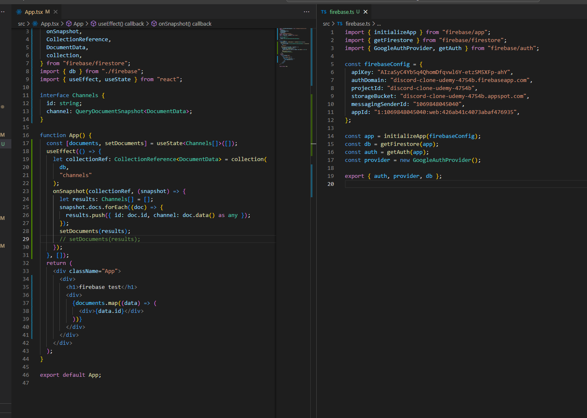

## error

```
Uncaught runtime errors:
ERROR
Expected type 'Query', but it was: a custom CollectionReference object
FirebaseError: Expected type 'Query', but it was: a custom CollectionReference object
ERROR
Expected type 'Query', but it was: a custom CollectionReference object
FirebaseError: Expected type 'Query', but it was: a custom CollectionReference object
ERROR
Expected type 'Query', but it was: a custom CollectionReference object
FirebaseError: Expected type 'Query', but it was: a custom CollectionReference object
```

```
Uncaught runtime errors:
ERROR
Expected first argument to collection() to be a CollectionReference, a DocumentReference or FirebaseFirestore
FirebaseError: Expected first argument to collection() to be a CollectionReference, a DocumentReference or FirebaseFirestore
ERROR
Expected first argument to collection() to be a CollectionReference, a DocumentReference or FirebaseFirestore
FirebaseError: Expected first argument to collection() to be a CollectionReference, a DocumentReference or FirebaseFirestore
```
- 解説(江藤さん回答)
    FirebaseのSDK（以下に記述するようなメソッドを提供するライブラリ）は、癖があって
    オリジナルのやつが使いにくかったりするときがある
    で、そのうえで、こういう使いづらさを解消したラッパーライブラリ（react-query-firebaseみたいなの)が出てきて、
    使いやすいようにカスタマイズされてたりするから、そういう選択肢になるんだろうなぐらいで思えばよさげ
    質問者のいうとおり41付近でおそらくなおるとおもう
    理由は、たぶん以下（４１をみてないからわからんけど
    ｄｂについて
    liteからインポートしてる流れになってたけど結局、github上ではfirebase/firestoreからインポートしてる
    これは、たぶん結局うごかんくなったから、そうした、と思ってよい
    collectionとかquery~とかのエラーに関するについて
    前述の同じ理由で書き方がえらい変わってる
    結局、firebase/firestoreからすべてのメソッド(query, collection, DocumentData, onSnapshotなど)を呼び出してる
    これも、たぶんreactでかくうえで、結局このimportでしかうごかんくなったんやろうとおもう
    

- その後
    コードを元の状態(const q ~   useEffect内等)に戻し、firebase.ts内のgetfirestoreを
    firebase/firestoreからimportしたら解除できた

    firebase/firestore/lite のliteはメリットもあるが不安定な状態が多い為、処理が正常に行われずに今回のようなエラーを吐き出すきっかけになった

    import先を変更することでエラーが解除された