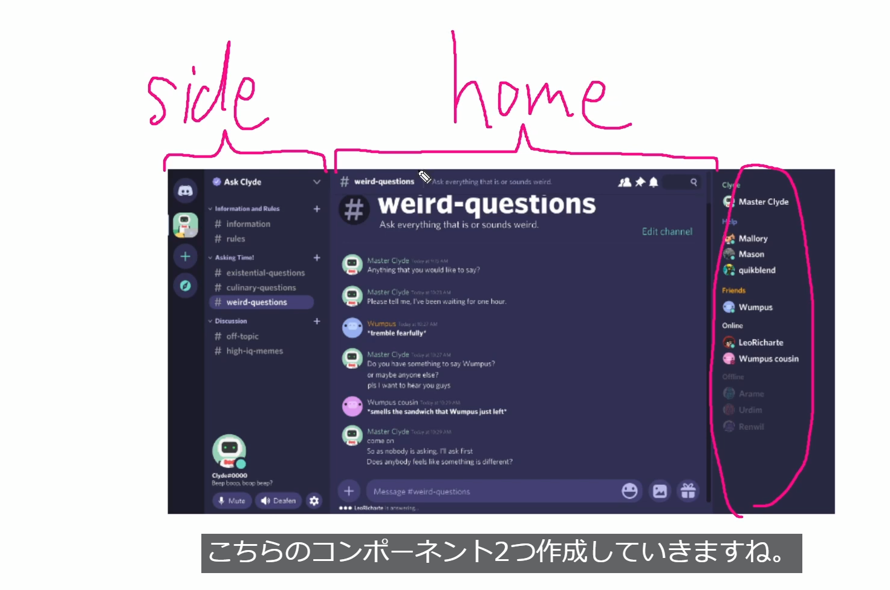

##　Reactの開発効率を上げる為のプラグインやショートカット

## plugin
- ES7+ React/Redux/React-Native snippets
    - rafce等のスニペット等の関数コンポーネントを自動で作成してくれる
- Auto Rename Tag
    - タグ<></>の名前を変更するときに同時に閉じタグまで変更してくれる
- Auto close Tag
    - 自動で閉じタグ```</tag>```を生成してくれる
- HTML CSS Support
    - HTMLやCSSを触る場合に導入
- Japanese Language Pack for Visual Studio
    - 日本語化する
- Material Icon Theme
    - ファイル等のアイコンをわかりやすく表示する
- Prettier - Code formatter
    - 自動的にコードフォーマットをしてくれる
    - 保存時に実行させたい場合は、vscode左上のファイル→ユーザー設定→設定
    　検索窓に(save)と入力しEditor:Format On Saveにチェックを入れる

## ショートカット
- ctrl+shift+x 
    - プラグインを選択する画面になる

## React導入
- URL https://create-react-app.dev/docs/adding-typescript/ 

- npx create-react-app discord_clone --template typescript 
    - typescriptを導入したReactをインストールするコマンド

## 初期設定
- package.json内のデバック内startをdevに変更
```
"scripts": {
    "dev": "react-scripts start",
    "build": "react-scripts build",
    "test": "react-scripts test",
    "eject": "react-scripts eject"}
```
- ターミナルでnpm run dev コマンドで起動
- 動作確認はhttp:/localhost:3000で確認

## 不要なファイルを削除
- setupTests.ts 
- reportWebVitals.ts 
- logo.svg 
- App.test.tsx

## 不要な記述を削除
- index.tsx
```
import reportWebVitals from './reportWebVitals';

// If you want to start measuring performance in your app, pass a function
// to log results (for example: reportWebVitals(console.log))
// or send to an analytics endpoint. Learn more: https://bit.ly/CRA-vitals
reportWebVitals();
```
- App.tsx
```
import logo from './logo.svg';


      <header className="App-header">

        <p>
          Edit <code>src/App.tsx</code> and save to reload.
        </p>
        <a
          className="App-link"
          href="https://reactjs.org"
          target="_blank"
          rel="noopener noreferrer"
        >
          Learn React
        </a>
      </header>
```

## cloneする範囲 UIの確認

