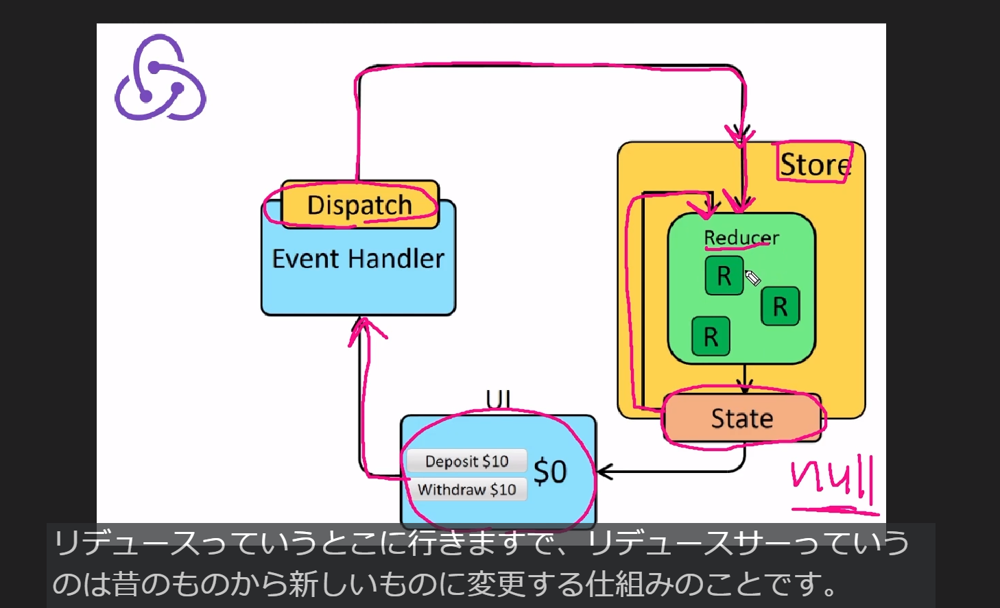

## ログインページ作成
- ユーザー情報が無いときはログインページを見せて、ユーザー情報がある時はsidebarとchatを見せる

- 1.ユーザー情報をReduxを使用して取ってくる
    useSelectorというReduxで用意されているhooksを使用してとってくる
    stateを引数で取ってユーザー情報を取得する

- 2.三項演算子でuser状態に対して表示する画面を切り替える
    三項演算子とは？以降がuserがtrueの時はsidebar,chatを表示しfalseの場合は：以降を表示する

    ```
          {user ?(
        <>
          {/* sidebar */}
          <Sidebar />
         {/* Chat */}
          <Chat />       
        </>
      ) : (
        <>
        <Login/>
        </>
      )}
    ```
- 3.Loginコンポーネント作成

## firebaseを使用してGoogleログイン機能を実装
- buttonタグにonClickを追加
- signIn関数を作成
  どうやってGoogleでログイン出来るのかをfirebaseのドキュメントに記載されている
  https://firebase.google.com/docs/auth/web/google-signin?hl=ja

  今回はpopupを使って実装(signInWithPopup(auth, provider))
  signInWithPopup(auth, provider)を使って引数にauth第二引数にproviderを指定すると実装できる

  catchはエラーの場合にアラートを出す処理
  ```
    const signIn = () => {
    signInWithPopup(auth,provider).catch((err) =>{
      alert(err.message);
    });
  };
  ```

この段階でGoogle認証は出来るがページは切り替わらない
どうすれば切り替えれるか
ReduxのDispatchというhooksを使って状態を更新する必要がある
DispatchしてReducerの中身でユーザーを更新する事でユーザーの状態がnullから中身がある状態に変化する


理由は下図
- storeはアプリ全体で管理されているもの
- storeの中にstateがある(ユーザーの初期状態はnullの状態)
- 初期状態の為ログインページが見えている
- このユーザーの状態をuserIdやdisplayname等の情報を持つ状態にしないといけない
- UIはログインボタンのこと
- ログインボタンを押すとイベントハンドラー(dispatch)が発火する
- まだDispatchを設定していない為、更新されていない
- stateはnullの状態dispatchが同時にReducerに入る
- Reducerは古いものから新しいものに変更する仕組み



- usersliceのReducerを実行したらstateのuser状態をactionpayloadで更新するという記述されている


- Reduxはとりあえず更新したいのであればdispatchを呼び出してあげることでselecterっていうのはstateの状態を取り出す
この2つを抑えればまぁ理解できている状態


## userにuid等のpeyloadをReduxのstoreにdispatch(通知)する作業
- 1.App.tsxにuseEffect(hooks)を用意する
  useEffectとは発火のタイミングを決める事が出来るhooksuseEffectとは発火のタイミングを決めれるhooks
  第二引数に変数を入れるとその変数が更新される度にuseEffectの中身が発火する
- 2.authをfirebaseから取ってきてonAuthStateChangedを記述する
　onAuthStateChangedはfirebaseの機能で認証状態が変わったらそのユーザーの情報を取得する関数
- 3.Dispatchを準備する(今回はTypescriptで記述している為、hooks.tsで準備したuseAppDispatchを使用)
- 4.useEffectの中にif文を記述
  ログインユーザーがいる場合はReduxのstoreにdispatch(通知)する
  今回Dispatchする内容はlogin
  このloginはuserSlice.tsから変数として取り出す
  actioncreaterを使ってdispatchしていく

useEffectの詳細


## ログインしたユーザー情報をUIに反映させる
  Reduxを使ってユーザー情報を取ってくる
  Reduxはstoreからどこのファイルからでも取ってくることができる

  - 1.sidebar.tsx内にuseAppSelectorを記述
  useAppSelectorは今のユーザーの状態を取ってくることができる
  ```
  const user = useAppSelector((state) => state.user)
  ```

  - 2.sidebarFooter内のimgタグを変更
  user?はnullの状態がある為、?を記述
  src={user?.photo}とし取得したユーザーのアイコンを表示
  ```
    auth.signOut()}/>
  ```

  - 3.sidebarFooter内のaccountName内のh4タグを変更
  ```
  <h4>{user?.displayName}</h4>
  ```

  - 4.sidebarFooter内のaccountName内のspanタグを変更
  ここはuidを表示する箇所だが、文字列が長い為、先頭の4文字だけを表示するように記述
  それがsubstring(0,4)となる
  ```
  <span>#{user?.uid.substring(0,4)}</span>
  ```

  - 5.sibebar.scssでアイコン画像を丸くする
  sidebar.scss内のsidebarAccount内のimgに対するCSSにborder-radius:50%をあてる
