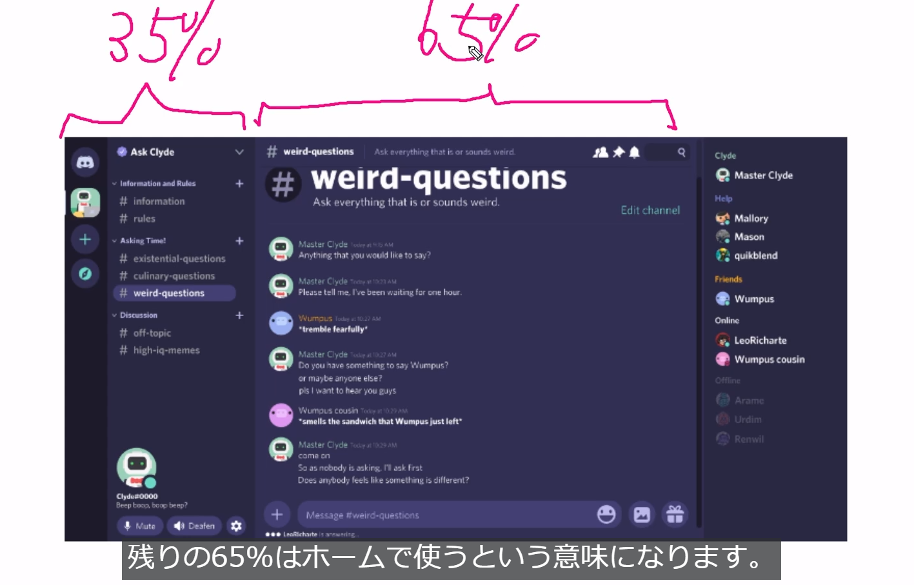
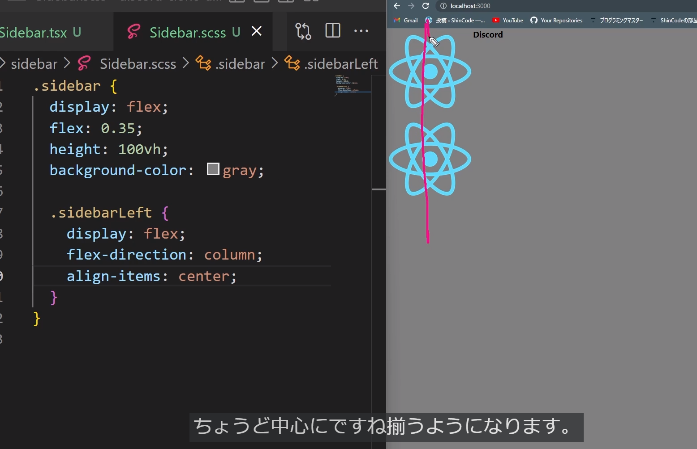

## css
- sidebar
- ```<div>```が縦並びとなっている為、横並びにする
    - flexで横並び
    - flex: 0.35;は画面内の35％を使用する
    ```
    .sidebar {
        display: flex;
        flex: 0.35;
    }
    ```


- flex-direction
    columnにすることで横並びを縦並びにする

- align-items
    centerで交差軸に対して中央揃えをする



- padding
    padding: 1px 2px
    1pxは上下　2pxは左右

- position: relative; position: absolute;
    サーバーアイコンの位置を親にしてそれに対しての絶対値を設定している

```
        .serverIcon {
            width: 60px;
            height: 60px;
            background-color: gray;
            // 〇を形成
            border-radius: 9999px;
            // imgの幅調整
            margin-bottom: 10px;
            // 画像のズレを真ん中に修正する
            position: relative;

            // 画像のサイズ
            img {
                position: absolute;
                width: 50px;
                top: 50%;
                left: 50%;
                transform: translate(-50%,-50%);
            }
        }
```

## サイドバー作成流れ
- header作成
- Channelリスト作成
- footer作成

- チャンネル追加ボタンの実装
    - +アイコンにカーソルをあてたときにポインター表示する
    ```
    <AddIcon/>にクラス名を追加後、CSSをあてる
    ```

    - ポインターをあてると条件が変わる(白く表示させる)
    &: は親がホバーしたときに実行するもの
    ```
            &:hover {
            color: white;
            background-color: #33363d;
            border-radius: 7px;
        }
    ```


- footer作成

    - 下記のコードはブラウザの左上が起点になっている
    - 親要素にposition:relativeをつけると親要素の左上が起点になる
    ```
    position:absolute
    ```
