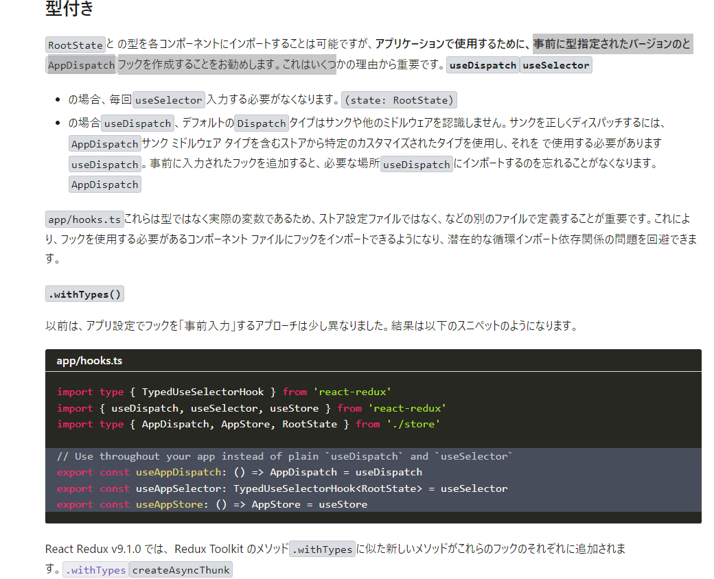

## 型付きのuseSelectorとuseDispatchを準備しよう
https://redux.js.org/usage/usage-with-typescript



- hookの事前に型指定したバージョンを作成すること

- 1.RootState,AppDispatchをstore.tsにて用意する
    Dispatchの型を用意
    
    export type = 型をエクスポート
    AppDispatch = 名前(なんでもいい)
    typeof store.dispatch; = store変数の中に入っているdispatchという型

    store.dispatchという型をAppDispatchという名前に入れることで
    AppDispatchという型を作る事が出来る

    ```
    export type AppDispatch = typeof store.dispatch;
    ```

    RootStateの型を用意(storeが現在持っている状態の型)

    getState = 現在の状態の型
    getStateをジェネリクス型で指定しておいてReturnType型で返す
    関数の型を返してそれをRootStateという名前にする

    ```
    export type RootState = ReturnType<typeof store.getState>;
    ```

- 2.RootState,AppDispatchを使ってuseSelector,useDispatchの型を定める
    appフォルダ内にhooks.tsファイルを準備する
    
    AppDispatch（無名関数）をstore.tsから持ってくる

    型が無名関数のAppDispatchとなる
    ```
    export const useAppDispatch: () =>AppDispatch = useDispatch
    ```

    AppDispatchとは先ほど作った現在のstoreの状態のdispatch

    TypedUseSelectorHookはインターフェース
    storeのRootstate　状態の為の適切な型
    ```
    export const useAppSelector: TypedUseSelectorHook<RootState> = useSelector;
    ```

