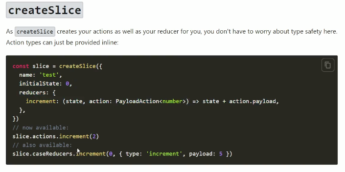

## Store作成方法
 https://redux-toolkit.js.org/api/configureStore

- srcディレクトリ内にappフォルダを作成後、store.tsを作成
- store.ts内の記述にてconfigureStoreにreducerを作る
- srcディレクトリ内にfeaturesフォルダを作成後、userSlice.tsを作成
    SliceとはState,Reducer,SctionCreatorを同時に作る事が出来る
    ※上記はReduxtoolkitを使用している為
- useSlice.ts内の記述にてcreateSliceを記述する
    ※createSlice内のプロパティにはname, initialState,reducersを含める事が出来る

- userSliceはユーザーのログイン状態やログアウト状態を監視する
- initialStateはユーザー状態がnull状態等を決める事が出来る
- reducersはログインとログアウトの処理を記述
    reducers内のloginの引数をstateとactionを渡し、現在のstate.userの状態をaction.payloadで更新するという記述
    ログアウトはstateだけ持っておいてstate.userの状態をnullにするだけでログアウトすることが出来る記述

    action.payloadは他のファイルでdispatchという操作が行われ、今のstateのユーザー状態が更新される
- 最後にexport defaultを行い、store.tsでimportする

## ユーザーの初期状態をTypescriptで準備
- srcフォルダ内に型定義用のファイルを作成(Types.ts)
- ユーザーのinitialstateの型を指定する
    ユーザー状態はnullの場合とそうじゃない場合の2パターンがあるので、両方を指定する
- 初期状態を型宣言したらuserslice.tsで受け取る
- initialStateで型定義をすることでstateを使う際にちゃんと指定された型になっているかをチェックすることができる

## storeをアプリ全体で使えるようにProviderを使用する
- index.tsx内の<App/>を<Provider>でラッピングする
    その際にエラーが発生するがProviderにpropsの形でstoreを渡すと解除される